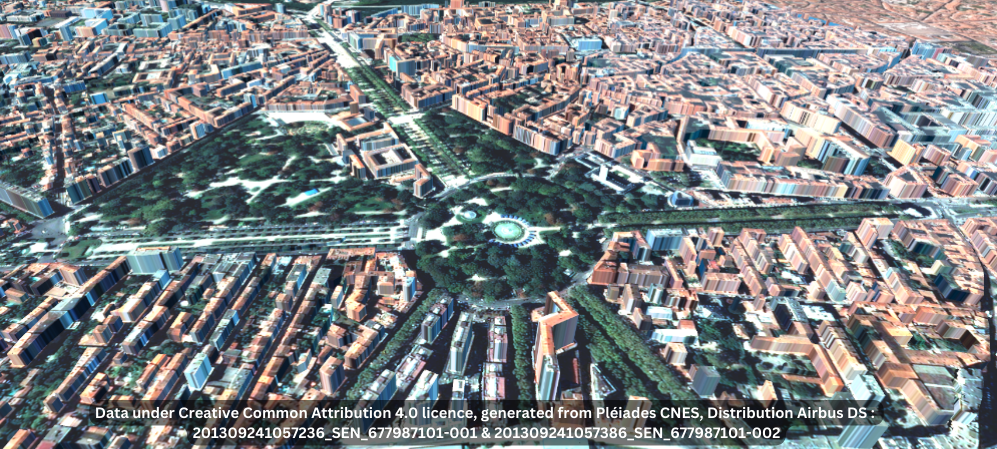

<div align="center">
  <a href="https://gitlab.cnes.fr/cars/cars_point_cloud_to_mesh"></a>


<h4>Cars Point cloud to Mesh</h4>

[](https://www.python.org/downloads/release/python-380/)

[](CONTRIBUTING.md)

<p>
  <a href="#overview">Overview</a> •
  <a href="#requirements">Requirements</a> •
  <a href="#quick-start">Quick Start</a> •
  <a href="#documentation">Documentation</a> •
  <a href="#contribution">Contribution</a> •
  <a href="#references">References</a>
</p>
</div>

## Overview

Cars Point cloud to Mesh short description:

Mesh Generation of cities from CARS point cloud

* Free software: Apache Software License 2.0
* Documentation: https://cars-point-cloud-to-mesh.readthedocs.io.


## Requirements

    python >= 3.8
    argparse                      # Python Argument Parser
    cars==0.8.*
    triangle>=20230923
    numpy
    numba
    scipy
    json-checker
    rasterio

## Quick Start

To install the plugin in a virtual environment:

```bash
git clone https://github.com/CS-SI/cars_point_cloud_to_mesh
cd cars-point-cloud-to-mesh

python3.8 -m venv venv
source venv/bin/activate

pip install -e .

# Patch a file in the current version of CARS (0.8.0), fixed in 0.9.0
patch --forward -p1 ./venv/lib/python3.8/site-packages/cars/applications/point_cloud_fusion/pc_tif_tools.py ./tests/cars_patch_data/patch_file_cars_pc_tif_tools


```

or 

```bash
git clone https://github.com/CS-SI/cars_point_cloud_to_mesh
cd cars-point-cloud-to-mesh

make install-dev

```

To use the plugin, first create a new config file (or use the default configuration available below) with `"pipeline" : "point_cloud_to_mesh"`. 

Then, using the venv created previously, run :

```
cars ./config.json
```

<details>
  <summary>Default configuration</summary>

```json
{
  "pipeline" : "point_cloud_to_mesh",
  "inputs": {
    "classification_buildings_description": ["building"],
    "dsm_color": "../clr.tif",
    "point_clouds": {
      "pc1": {
        "x": "epi_pc_X.tif",
        "y": "epi_pc_Y.tif",
        "z": "epi_pc_Z.tif",
        "classification": "epi_classification.tif",
        "color": "epi_pc_color.tif",
        "mask": "epi_pc_msk.tif"
      }
    }
  },
  "applications": {
    "create_dtm_mesh": {
      "method": "percentile_of_unclassified_points"
    },
    "point_clouds_and_polygons_to_mesh": {
      "method": "alpha_shape_delaunay_dtm_projection",
      "out_mesh_mode": "texture"
    }
  },
  "output": {
    "out_dir": "./out_meshes/",
    "out_epsg": 4978
  }
}
```

</details>

The files pointed at by the configuration must be the output of CARS's main pipeline with these options enabled :

```json
{
  "triangulation": {
    "use_geoid_alt": true,
    "save_points_cloud": true
  },
  "point_cloud_rasterization": {
    "save_classif": true
  }
}  

```

To generate files that may be useful, such as a geojson containing points where vegetation is present (with its height) or a png file with classifications such as water bodies and vegetation, run the notebooks located in `/notebooks` with the appropriate files pointed at by the configuration in the first cell of said notebooks.

## Documentation

Go in docs/ directory


* Documentation: https://cars-point-cloud-to-mesh.readthedocs.io.


## Contribution

See [Contribution](./CONTRIBUTING.md) manual


## LICENCE

See [LICENCE](./LICENCE) 
* Free software: Apache Software License 2.0
* The triangle library is published under the LGPL 3.0 : the licence is weak copyleft, where other licences are permissive licences. However, Triangle's terms of use ensure that its licence does not extend to other components of the project, nor to the project itself.


## References

See [CARS github](https://github.com/CNES/cars) 

