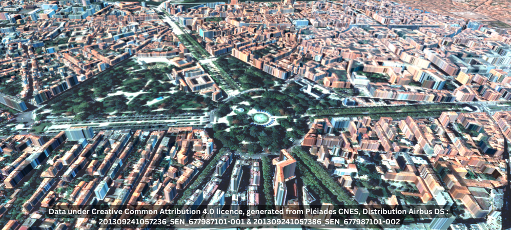

<div align="center">
<a target="_blank" href="https://github.com/CNES/cars">
<picture>
  
</picture>
</a>


<h4>Cars Point cloud to Mesh</h4>

[](https://www.python.org/downloads/release/python-3100/)

[](CONTRIBUTING.md)

<p>
  <a href="#overview">Overview</a> •
  <a href="#requirements">Requirements</a> •
  <a href="#quick-start">Quick Start</a> •
  <a href="#documentation">Documentation</a> •
  <a href="#contribution">Contribution</a> •
  <a href="#references">References</a>
</p>
</div>

## Overview

Cars Point cloud to Mesh short description:

Mesh Generation of cities from CARS point cloud

* Free software: Apache Software License 2.0
* Documentation: https://cars-point-cloud-to-mesh.readthedocs.io.


## Requirements

    python >= 3.10
    argparse                      # Python Argument Parser
    cars==1.0.0
    triangle>=20230923
    numpy
    numba
    scipy
    json-checker
    rasterio

## Quick Start

To install the plugin in a virtual environment:

```bash
git clone https://github.com/CS-SI/cars_point_cloud_to_mesh
cd cars-point-cloud-to-mesh

python3.10 -m venv venv
source venv/bin/activate

pip install -e .
```

or 

```bash
git clone https://github.com/CS-SI/cars_point_cloud_to_mesh
cd cars-point-cloud-to-mesh

make install-dev
```
### Using the mesh plugin

To use the mesh plugin, first create a configuration file with:

```json
"pipeline": "point_cloud_to_mesh"
```

Then, using the virtual environment created previously, run:

```bash
cars ./config.json
```

<details>
  <summary>Mesh plugin configuration</summary>

This configuration corresponds to the mesh generation pipeline.
It consumes products generated by the base CARS pipeline (depth_map and dsm)

```json
{
  "pipeline" : "point_cloud_to_mesh",
  "input": {
    "classification_buildings_description": ["1"],
    "dsm_color": "dsm/image.tif",
    "depth_map": {
      "dm1": {
        "x": "depth_map/left_right/X.tif",
        "y": "depth_map/left_right/Y.tif",
        "z": "depth_map/left_right/Z.tif",
        "classification": "depth_map/left_right/classification.tif",
        "image": "depth_map/left_right/image.tif"
      }
    }
  },    
  "applications": {
    "create_dtm_mesh": {
      "method": "percentile_of_unclassified_points"
    },
    "point_clouds_and_polygons_to_mesh": {
      "method": "alpha_shape_delaunay_dtm_projection",
      "out_mesh_mode": "texture"
    }
  },    
  "output": {
    "directory": "out_meshes/",
    "epsg": 4978
  }
}
```

This pipeline:
- Reads depth map X/Y/Z products
- Uses classification layers
- Uses DSM color image
- Generates textured or non-textured 3D meshes

</details>


### Generating required inputs with the base CARS pipeline

Before running the mesh plugin, you must generate compatible depth_map and dsm products using the base CARS pipeline.

Below is the minimal configuration required.

<details>
  <summary>Base CARS configuration</summary>

This configuration runs the standard CARS stereo pipeline.

```json
{
    "input": {
        "sensors": {
            "left": {
                "image": "color_left.tif",
                "geomodel": { "path": "color_left.geom", "model_type": "RPC" },
                "classification": "classification.tif"
            },
            "right": {
                "image": "color_right.tif",
                "geomodel": { "path": "color_right.geom", "model_type": "RPC" }
            }
        },
        "pairing": [["left", "right"]]
    },
    "output": { 
        "directory": "out_cars/", 
        "product_level": [
            "dsm",
            "depth_map"
        ],
        "auxiliary": {
            "image": true,
            "classification": true
        }
    }
}
```

This configuration ensures that:
- A depth map product is generated.
- The DSM product is available.
- Auxiliary image and classification layers are exported.
- The classification layer is provided as input for the left sensor, which is required by the mesh pipeline.

</details>


### Additional products via notebooks

To generate additional products such as:
- A GeoJSON containing vegetation points with estimated height
- PNG classification maps (water bodies, vegetation, etc.)

Run the notebooks located in:

`/notebooks`

Make sure to update the file paths in the first cell of each notebook to match the outputs generated by the base CARS pipeline and/or the mesh plugin.


## Documentation

Go in docs/ directory


* Documentation: https://cars-point-cloud-to-mesh.readthedocs.io.


## Contribution

See [Contribution](./CONTRIBUTING.md) manual


## LICENCE

See [LICENCE](./LICENCE) 
* Free software: Apache Software License 2.0
* The triangle library is published under the LGPL 3.0 : the licence is weak copyleft, where other licences are permissive licences. However, Triangle's terms of use ensure that its licence does not extend to other components of the project, nor to the project itself.


## References

See [CARS github](https://github.com/CNES/cars) 

